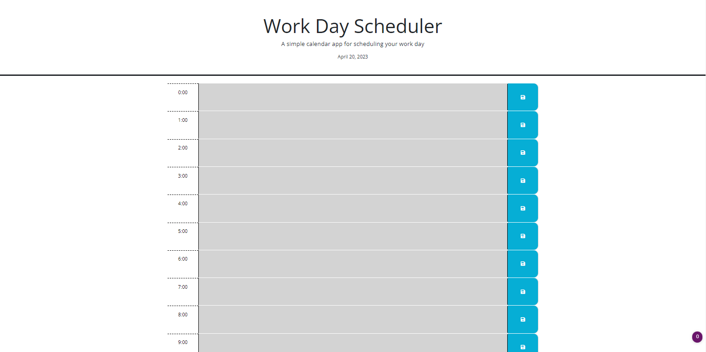

# bootcamp-day-planner

## Description 
A simple day planner website with persistent text input fields, allowing for the user's schedule to be updated and maintained.

[A link to the repository.](https://github.com/AddisonNoxy/bootcamp-day-planner)

## Installation
N/A

## Usage 
Type basic text into the input fields fo9r each hour. When you press the save button, the text in the correct time slot will be saved. Reloading the page will keep your data.

## Credits
N/A

## License
Please refer to the LICENSE in the repo.